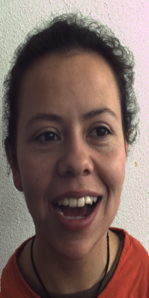

<!-- 
 
  

 -->
<h1 align="center"> Imageful </h1>
<h3 align="center"> COMP 1730460 - Foundations of Computer Vision </h3>
<h5 align="center"> Course Final Project - <a href="https://english.iut.ac.ir/">Isfahan University of Technology</a> (Summer 2022) </h5>

<!-- 
 
  

 -->

  
   
  

<!-- TABLE OF CONTENTS -->
<h2 id="table-of-contents"> 📖 Table of Contents</h2>

  
Table of Contents

  <ol>
    <li><a href="#about-the-project"> ➤ About The Project</a></li>
    <li><a href="#overview"> ➤ Overview</a></li>
    <li><a href="#project-files-description"> ➤ Project Files Description</a></li>
    <li><a href="#getting-started"> ➤ Getting Started</a></li>
    <li><a href="#scenario1"> ➤ Scenario 1: Depth First Search </a></li>
    <li><a href="#references"> ➤ References</a></li>
    <li><a href="#credits"> ➤ Credits</a></li>
  </ol>

<!-- ABOUT THE PROJECT -->
<h2 id="about-the-project"> 📝 About The Project</h2>

  Display devices come with varying resolutions and aspect ratios, necessitating the resizing of images to fit these different screens properly. Also, it is important to protect the critical content of the images and prevent distortions as much as possible in resized images. Content-Aware Image Retargeting (CAIR) techniques provide a promising solution to this ongoing challenge. The process of CAIR involves altering the resolution and aspect ratio of images to address these essential aspects as effectively as possible. This adaptation is achieved by adhering to geometric constraints and adopting a content-aware approach.

<!-- OVERVIEW -->
<h2 id="overview"> ☁️ Overview</h2>

 
  "Imageful" is a content-aware image retargeting project developed for the Foundations of Computer Vision course. It intelligently resizes images while preserving their essential content and visual appeal. With its innovative approach, Imageful ensures that crucial elements in the image remain undistorted during resizing, making it a valuable tool for various multimedia applications.

<!-- PROJECT FILES DESCRIPTION -->
<h2 id="project-files-description"> 💾 Project Files Description</h2>

<ul>
  <li><b>search.py</b> - Where all of the search algorithms reside.</li>
  <li><b>searchAgents.py</b> - Where all of the search-based agents reside.</li>
  <li><b>pacman.py</b> - The main file that runs Pacman games. This file also describes a Pacman GameState types.</li>
  <li><b>game.py</b> - The logic behind how the Pacman world works.</li>
  <li><b>util.py</b> - Useful data structures for implementing search algorithms.</li>
</ul>

<h3>Some other supporting files</h3>
<ul>
  <li><b>graphicsDisplay.py</b> - Graphics for Pacman.</li>
  <li><b>graphicsUtils.py</b> - Support for Pacman graphics.</li>
  <li><b>textDisplay.py</b> - ASCII graphics for Pacman.</li>
  <li><b>ghostAgents.py</b> - Agents to control ghosts.</li>
  <li><b>keyboardAgents.py</b> - Keyboard interfaces to control Pacman.</li>
  <li><b>layout.py</b> - Code for reading layout files and storing their contents.</li>
  <li><b>autograder.py</b> - Project autograder.</li>
  <li><b>testParser.py</b> - Parses autograder test and solution files.</li>
  <li><b>testClasses.py</b> - General autograding test classes.</li>
  <li><b>test_cases/</b> - Directory containing the test cases for each scenario.</li>
  <li><b>searchTestClasses.py</b> - Project specific autograding test classes.</li>
</ul>

<!-- GETTING STARTED -->
<h2 id="getting-started"> 📖 Getting Started</h2>

You are able to start the game by typing the following commands in the command line:

<pre><code>$ python pacman.py</code></pre>

You can see the list of all options and their default values via:

<pre><code>$ python pacman.py -h</code></pre>
<i>Note that all of the commands that appear in this project also appear in <code>commands.txt</code>, for easy copying and pasting.</i>

<!-- SCENARIO1 -->
<h2 id="scenario1"> 🔸 Scenario 1: Finding a Fixed Food Dot using Depth First Search</h2>

I have implemented the depth-first search (DFS) algorithm in the depthFirstSearch function in <code>search.py</code>.

The Pacman will quickly find a solution via running the following commands:

<pre><code>$ python pacman.py -l tinyMaze -p SearchAgent</code></pre>
<pre><code>$ python pacman.py -l mediumMaze -p SearchAgent</code></pre>
<pre><code>$ python pacman.py -l bigMaze -z .5 -p SearchAgent</code></pre>

 

<!--height="382px" width="737px"-->

<!-- REFERENCES -->
<h2 id="References"> 🔸 Scenario 8: Suboptimal Search</h2>

In this scenario, I have implemented a function that helps Pacman agent to find a path to the closest dot.

This function has been written in <code>searchAgents.py</code>

The Pacman will quickly find a solution via running the following command:

<pre><code>$ python pacman.py -l bigSearch -p ClosestDotSearchAgent -z .5</code></pre>

 

<!-- CREDITS -->
<h2 id="Credits"> 📜 Credits</h2>

Mohammad Amin Shamshiri

Acknowledgements: Based on UC Berkeley's Pacman AI project, <a href="http://ai.berkeley.edu">http://ai.berkeley.edu</a>

